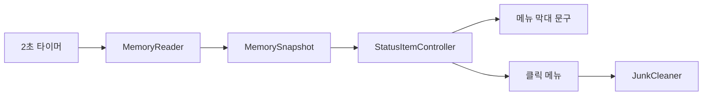

# MemLite 개발 계획

## 개요

MemLite는 macOS 상단 메뉴 막대에서 메모리 사용량을 보여주는 개인용 앱이다. 활성상태보기와 같은 메모리 항목을 읽되, 상주 창은 두지 않는다. 메뉴 막대에는 짧은 숫자와 단계 색만 표시하고, 클릭하면 상세 항목을 메뉴로 펼친다. 같은 메뉴에서 정크 파일 정리, 로그인 시 열기, 버전을 본다. 개발이 끝나면 다른 Mac 앱처럼 DMG로 설치한다.

## 목표와 범위

### 목표

- 전체 메모리와 현재 사용 중인 메모리를 메뉴 막대에서 바로 본다.
- 시스템 메모리 압력에 따라 사용량 숫자 색으로 안전, 주의, 위험을 구분한다.
- 클릭 한 번으로 활성상태보기의 메모리 상세 항목과 정크 용량을 본다.
- 메뉴를 열면 지워도 되는 정크 용량을 보여 주고, **정크 파일 정리…** 에서 확인한 뒤에만 지운다.
- 메뉴에서 로그인 시 열기를 켜고 끈다. 버전은 한 줄로만 보여 준다.
- 완료된 앱을 DMG로 열어 응용 프로그램 폴더에 넣어 설치한다.

### 포함

- 메뉴 막대 텍스트 (`19.7 / 24 GB`). 메뉴 막대 아이콘은 넣지 않는다
- 사용량 숫자의 단계 색
- 클릭 메뉴의 메모리 상세 수치
- 메뉴를 열면 보이는 정크 용량 (휴지통, 사용자 캐시, 사용자 로그, 정크 합계)
- 정크 파일 정리 (휴지통, 사용자 캐시, 사용자 로그)
- 로그인 시 열기 (`SMAppService.mainApp`)
- 버전 한 줄 (`MemLite 1.0`)
- Finder·응용 프로그램 폴더용 앱 아이콘
- 메뉴에서 앱 종료
- 설치용 `MemLite.dmg`

### 제외

- 메인 창, 설정 창, Dock 아이콘
- 메모리 압력 그래프
- 색상 아이콘 (동그라미, 네모)
- 메모리 정리 (파일 캐시 강제 비우기)
- 디스크 전체 검색, 시스템 폴더 정리
- 브라우저 프로필, 개발 도구 찌꺼기 등 추가 위치 정리
- 지우면 계정, 동기화, 보관함, 보안, 시스템 동작에 문제가 생기는 파일
- App Store 배포, 자동 업데이트, 설정 창
- 메뉴 막대 상태 아이콘 (글자만 표시)

## 지원 OS

- 최소 버전: macOS 14.0 (Sonoma)
- 이후 macOS에서도 같은 메뉴 막대 API와 메모리 통계 API를 사용한다.
- 개인용으로만 실행한다. App Store 제출과 공증은 범위 밖이다. 설치 동작은 DMG에서 응용 프로그램 폴더로 복사하는 일반적인 방식으로 맞춘다.

## 화면 사양

앱은 메뉴 막대 항목만 가진다. `LSUIElement`를 켜서 Dock 아이콘과 앱 전환기에 나타나지 않게 한다.

### 메뉴 막대

표시 형식은 `19.7 / 24 GB`이다.

- 앞 숫자: 사용된 메모리 (GB, 소수 한 자리)
- 뒤 숫자: 물리적 메모리 (GB, 소수 한 자리)
- 단위 `GB`는 한 번만 붙인다.

색은 사용량 숫자에만 적용한다. `/ 24 GB`는 메뉴 막대 기본 글자색을 유지해 밝은 배경과 어두운 배경 모두에서 읽히게 한다.

| 단계 | 색 | 시스템 압력 |
| --- | --- | --- |
| 안전 | 녹색 | normal (`0x1`) |
| 주의 | 주황색 | warning (`0x2`) |
| 위험 | 빨간색 | urgent (`0x4`), critical (`0x8`) |

색 기준은 사용 비율이 아니다. 사용량이 높아도 대부분이 캐시이면 압력은 안전(녹색)일 수 있다. 색은 `kern.memorystatus_vm_pressure_level` 값을 따른다.

메뉴가 열려 항목이 강조된 동안에는 사용량 숫자도 기본 글자색으로 되돌린다. 선택 배경 위에 녹색, 주황색, 빨간색이 남지 않게 하기 위해서다. 메뉴가 닫히면 압력 단계 색으로 다시 칠한다.

글자색은 AppKit `NSStatusItem` 버튼의 `attributedTitle`로 넣는다. 메뉴 막대에는 이미지를 넣지 않는다. SwiftUI `MenuBarExtra` 레이블은 메뉴 막대에서 색이 빠질 수 있으므로 사용하지 않는다.

응용 프로그램 폴더와 DMG에 보이는 앱 아이콘은 `assets/icon-menubar.png`의 흰 M이다. 작은 크기에서 뭉개지는 금속 질감 원본(`assets/icon-app.png`)은 앱 아이콘으로 쓰지 않는다. `LSUIElement`라서 실행 중이어도 Dock 실행 점은 나오지 않는다.

### 클릭 메뉴

왼쪽 메모리 압력 그래프는 넣지 않는다. 항목은 활성상태보기 메모리 탭과 같은 이름을 쓴다. 값은 GB 소수 두 자리로 표시한다. 스왑이 0이면 `0바이트`로 표시한다.

| 항목 | 예시 |
| --- | --- |
| 물리적 메모리 | 24.00GB |
| 사용된 메모리 | 19.68GB |
| 캐시된 파일 | 4.43GB |
| 사용된 스왑 공간 | 0바이트 |
| 앱 메모리 | 8.71GB |
| 와이어드 메모리 | 2.32GB |
| 압축됨 | 7.90GB |

메모리 상세 아래 구분선을 두고 눌리지 않는 정크 용량 4항목을 둔다. 처음 열면 `계산 중…`을 보인 뒤 값을 채운다.

| 항목 | 예시 |
| --- | --- |
| 휴지통 | 0바이트 |
| 사용자 캐시 | 1.23GB |
| 사용자 로그 | 0.05GB |
| 정크 합계 | 1.28GB |

그 아래 구분선을 두고 **정크 파일 정리…** 와 **로그인 시 열기**를 둔다. 다시 구분선을 두고 눌리지 않는 **MemLite 1.0**과 **종료**를 둔다. Dock 아이콘이 없으므로 종료는 메뉴에만 있다.

로그인 시 열기는 설정 창 없이 메뉴 체크만 쓴다. `SMAppService.mainApp`으로 등록하고 해제한다. 응용 프로그램 폴더에 설치한 앱에서만 켜진다. Xcode에서 바로 실행한 빌드에서는 실패할 수 있고, 그때는 안내를 띄운다. 메뉴를 열 때마다 체크 상태를 다시 읽는다.

### 정크 파일 정리

대기 중과 2초 메모리 갱신에는 폴더를 살펴보지 않는다. 메뉴를 열 때 아래 세 위치의 용량을 계산해 메뉴에 보여 준다. **정크 파일 정리…** 는 지우기 확인에만 쓴다.

| 항목 | 경로 |
| --- | --- |
| 휴지통 | `~/.Trash` |
| 사용자 캐시 | `~/Library/Caches` |
| 사용자 로그 | `~/Library/Logs` |

용량과 삭제 대상에는 지워도 앱과 시스템이 다시 만들 수 있는 파일만 넣는다. 지우면 사용자 데이터, 로그인, 동기화, 보관함이 깨지는 파일은 용량 계산에서도 빼 둔다.

계산이 끝나면 확인 창에 지울 수 있는 용량만 항목별과 합계로 보여 준다. 확인 창은 상주 창이 아니라, 지우기 직전에만 뜨는 알림이다. 사용자가 확인하면 그 파일만 지운다. 세 폴더 자체는 남긴다. 실제로 지운 용량을 짧게 알린다.

용량 계산과 삭제는 메인 스레드 밖에서 한다. 그동안 메뉴 막대의 메모리 표시는 그대로 갱신된다.

캐시를 지우면 해당 앱이 다음에 캐시를 다시 만들 수 있다. 용량은 줄어도 그 직후 앱이 잠시 느려질 수 있다. `/Library`, `/System`, 외장 볼륨의 휴지통은 대상에 넣지 않는다.

#### 삭제에서 빼는 파일

공통으로 빼는 것:

- 세 위치의 폴더 자체
- 세 위치 밖을 가리키는 심볼릭 링크와 앨리어스. 링크는 따라가지 않고, 원본은 지우지 않는다.
- 잠긴 파일 (`UF_IMMUTABLE`, `SF_IMMUTABLE`, `UF_APPEND`)
- 다른 프로세스가 열어 둔 파일
- 경로를 풀었을 때 세 위치 안에 있지 않은 파일

휴지통은 사용자가 이미 버린 파일만 지운다. 링크의 원본과 잠긴 파일은 빼 둔다.

로그는 일반 로그와 진단 리포트만 지운다. 사용 중이거나 잠긴 파일, 링크는 빼 둔다.

사용자 캐시는 앱이 다시 만들 임시 파일만 지운다. `~/Library/Caches` 바로 아래 이름이 아래에 해당하면 그 폴더 전체를 용량과 삭제에서 뺀다.

- 계정·보안: `com.apple.akd`, `com.apple.accountsd`, `com.apple.AppleMediaServices`, `com.apple.amsaccountsd`, `com.apple.amsengagementd`, `com.apple.identityservicesd`, `com.apple.ids`, `com.apple.security`, `com.apple.ProtectedCloudStorage`, `com.apple.TrustEvaluationAgent`
- iCloud·동기화: `CloudKit`, `com.apple.bird`, `com.apple.CloudDocs`, `com.apple.iCloudDriveCore`, `com.apple.HomeKit`, `com.apple.icloud`로 시작하는 항목
- 메일·메시지·사진·음악: `com.apple.Mail`, `com.apple.mail`, `com.apple.Messages`, `com.apple.imfoundation`, `com.apple.imagent`, `com.apple.Photos`, `com.apple.photolibraryd`, `com.apple.Music`, `com.apple.iTunes`, `com.apple.itunescloudd`, `com.apple.AMPLibraryAgent`
- 시스템 동작: `com.apple.Spotlight`, `com.apple.FontRegistry`, `com.apple.ATS`, `com.apple.nsurlsessiond`, `com.apple.nsurlstoraged`, `com.apple.MobileAsset`로 시작하는 항목, `com.apple.sharedfilelist`, `com.apple.containermanagerd`

## 데이터 계산

통계는 관리자 권한과 개인정보 접근 권한 없이 읽는다.

### 출처

- 물리적 메모리: `sysctl` `hw.memsize`
- 페이지 구성: `host_statistics64`의 `vm_statistics64`
- 스왑: `sysctl` `vm.swapusage`의 `xsu_used`
- 압력 단계: `sysctl` `kern.memorystatus_vm_pressure_level`

바이트 환산은 각 페이지 수에 페이지 크기를 곱한다.

### 항목 식

- 앱 메모리 = `(internal_page_count - purgeable_count) * pageSize`
- 와이어드 메모리 = `wire_count * pageSize`
- 압축됨 = `compressor_page_count * pageSize`
- 캐시된 파일 = `(external_page_count + purgeable_count) * pageSize`
- 사용된 메모리 = 앱 메모리 + 와이어드 메모리 + 압축됨
- 물리적 메모리 = `hw.memsize`
- 사용된 스왑 공간 = `xsu_used`

각 항목을 소수 두 자리 GB로 반올림하면, 앱 메모리 + 와이어드 메모리 + 압축됨의 표시 합이 사용된 메모리 표시값과 조금씩 다를 수 있다. 계산은 바이트 기준으로 하고, 반올림은 화면에 보일 때만 한다.

### 표시 단위

- 메뉴 막대: GB, 소수 한 자리 (`19.7 / 24 GB`)
- 상세 메뉴: GB, 소수 두 자리 (`19.68GB`)
- 스왑이 0바이트: `0바이트`
- 스왑이 0보다 크면 다른 항목과 같이 GB 소수 두 자리

## 앱 구조

Xcode macOS App으로 만든다. 언어는 Swift, UI는 AppKit이다. 배포 타깃은 macOS 14.0이다. 개인용이므로 App Sandbox는 끈다.

```text
MemLite/
  MemLite.xcodeproj
  MemLite/
    MemLiteApp.swift          앱 진입점
    AppDelegate.swift         상태 항목 생성, 타이머 시작
    MemorySnapshot.swift      메모리 수치와 압력 단계
    MemoryReader.swift        sysctl, host_statistics64 읽기
    JunkCleaner.swift         정크 대상 용량 계산과 삭제
    StatusItemController.swift 메뉴 막대 문구, 색, 클릭 메뉴
    Assets.xcassets           앱 아이콘
    Info.plist                LSUIElement
  assets/
    icon-menubar.png          앱 아이콘 원본
    icon-app.png              쓰지 않는 금속 질감 초안
  scripts/
    create-dmg.sh             Release 앱으로 설치용 DMG 생성
  docs/
    development-plan.md
    handOff.md
  README.md
```

역할은 아래와 같이 나눈다.

- `MemoryReader`는 통계만 읽고 `MemorySnapshot`을 만든다.
- `JunkCleaner`는 메뉴를 열었을 때와 지우기를 고를 때만 세 폴더를 보고, 지워도 되는 파일의 용량만 계산한 뒤 그 파일만 지운다.
- `StatusItemController`는 스냅샷을 메뉴 막대 문구와 메뉴 항목으로 그리고, 정크 용량 표시, 정리 확인 창, 로그인 시 열기를 다룬다.
- `AppDelegate`는 약 2초 간격으로 메모리 읽기만 호출하고, 메뉴가 열린 상태인지를 컨트롤러에 전달한다.



## 갱신과 성능

- 주기는 2초로 둔다.
- 한 주기에 `host_statistics64` 한 번과 `sysctl` 소량만 호출한다.
- 압력 단계가 같고 표시 문자열이 같으면 메뉴 막대 문구를 다시 그리지 않는다.
- 메뉴가 열려 있는 동안에도 수치는 갱신한다. 이때 사용량 숫자 색만 기본 글자색으로 유지한다.
- 정크 파일 용량 계산과 삭제는 2초 주기에 넣지 않는다. 메뉴를 열 때 용량을 읽고, **정크 파일 정리…** 를 골랐을 때만 지운다.

## 설치용 DMG

앱 구현과 동작 확인이 끝난 뒤 Release 빌드로 `MemLite.dmg`를 만든다. 디스크를 열면 다른 Mac 앱 설치 화면과 같이 앱과 응용 프로그램 폴더가 나란히 보인다. 사용자는 `MemLite.app`을 응용 프로그램 폴더로 끌어다 놓는다.

DMG 안에 넣는 것:

- `MemLite.app`
- `/Applications`로 연결되는 응용 프로그램 폴더 링크

창 제목은 `MemLite`로 둔다. 아이콘 배치를 고정해, 앱을 오른쪽 폴더로 끌어 넣으면 설치가 끝나게 한다. 설치 파일은 `dist/MemLite.dmg`에 만든다.

메뉴 막대 앱이라 설치 후에도 Dock에는 남지 않는다. 응용 프로그램 폴더나 Spotlight에서 MemLite를 한 번 열면 메뉴 막대에 나타난다.

개인용 빌드라 공증은 하지 않는다. 이 Mac에서는 응용 프로그램 폴더로 복사한 뒤 바로 실행한다. 다른 Mac에서 처음 열 때 Gatekeeper가 막으면, 해당 앱을 우클릭해 열거나 시스템 설정에서 허용한다.

## 구현 순서

1. macOS 14.0 타깃의 AppKit 앱을 만들고 `LSUIElement`를 켠다.
2. `MemoryReader`에서 물리 메모리, VM 통계, 스왑, 압력 단계를 읽어 스냅샷으로 만든다.
3. 스냅샷으로 `19.7 / 24 GB` 문구와 상세 메뉴 문자열을 만든다.
4. 사용량 숫자에 압력 단계 색을 칠하고, 메뉴가 열린 동안에는 기본 글자색으로 되돌린다.
5. 클릭 메뉴에 상세 7항목, 정크 용량 4항목, 정크 파일 정리, 로그인 시 열기, 버전, 종료를 넣는다.
6. 2초 타이머로 메뉴 막대와 열린 메뉴의 메모리 수치를 함께 갱신한다.
7. `JunkCleaner`로 지워도 되는 파일만 골라 용량을 계산하고, 확인 후에 그 파일만 지운다.
8. Release 빌드로 `scripts/create-dmg.sh`를 실행해 `dist/MemLite.dmg`를 만든다.

## 확인 방법

로컬에서 앱을 실행한 뒤 활성상태보기 메모리 탭과 나란히 비교한다.

- Dock 아이콘과 메인 창이 없다.
- 메뉴 막대 문구가 `사용량 / 전체 GB` 형식이다.
- 사용량 숫자만 녹색, 주황색, 빨간색 중 하나로 보이고 나머지 글자는 기본색이다.
- 메뉴를 연 동안 사용량 숫자가 강조 배경 위에서 기본 글자색으로 바뀐다.
- 메뉴를 닫으면 압력 단계 색이 돌아온다.
- 상세 항목 이름과 값이 활성상태보기와 같은 기준으로 맞다. GB 반올림 차이만 허용한다.
- 스왑이 없으면 `0바이트`로 보인다.
- 메뉴를 열면 휴지통, 사용자 캐시, 사용자 로그, 정크 합계가 보이고, 2초 주기에는 이 폴더를 살펴보지 않는다.
- 정리를 고르기 전에는 파일을 지우지 않는다. 확인 창에서 취소하면 파일이 지워지지 않는다.
- 확인하면 그 파일만 지워지고 세 폴더 자체는 남는다.
- 계정, iCloud, 메일·메시지·사진·음악, 보안, Spotlight, 폰트, 진행 중 다운로드, 잠긴 파일, 사용 중인 파일, 폴더 밖 링크는 용량에 포함되지 않고 지워지지도 않는다.
- 메뉴 막대에는 아이콘 없이 숫자만 보인다.
- 응용 프로그램 폴더의 앱 아이콘은 흰 M이다.
- 메뉴에 **로그인 시 열기**와 눌리지 않는 **MemLite 1.0**이 있다.
- 종료를 누르면 메뉴 막대에서 사라진다.
- `MemLite.dmg`를 열면 앱과 응용 프로그램 폴더가 보이고, 앱을 그 폴더로 복사하면 `/Applications/MemLite.app`에 설치된다.
- 설치한 앱을 한 번 열면 메뉴 막대에 나타난다.
